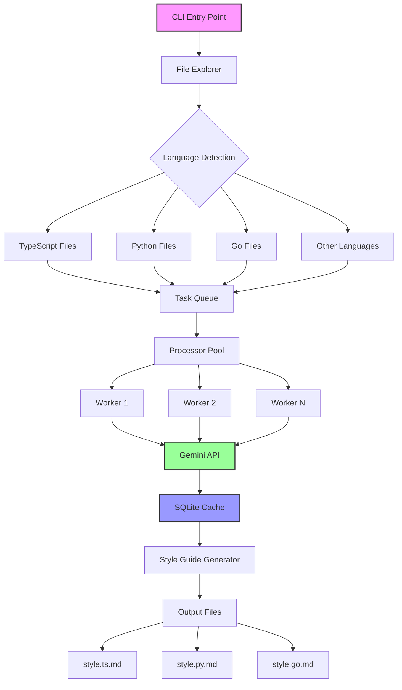

# context42

**The best code style guide is the one your team already follows.** This tool discovers it.

Let a little AI magic loose in your repo: context42 explores your codebase, chats with Google Gemini, and conjures up custom style guides for every language it finds.

## Demo

```bash
$ export GEMINI_API_KEY="..."
$ npx context42 # or bunx, pnpx, yarn dlx

 Exploring codebase...
 Processing 47 directories with Gemini
 Generated: ./context42/style.py.md, ./context42/style.ts.md, ./context42/style.go.md
```

## Install

```bash
# Run directly (recommended)
npx context42

# Or install globally
npm install -g context42
```

## Usage

```bash
# Analyze current directory, saves results to ./context42/
context42

# Analyze specific directory
context42 -i src/

# Custom output location
context42 -o .cursor/rules/

# Set max concurrent Gemini processes (default: 4)
context42 --concurrency 8

# Resume from a previous run (useful for debugging)
context42 --run abc123-def456

# Enable debug mode (shows run ID on errors)
context42 --debug
```

## New Features

- **Automatic Cleanup**: Temporary style files are automatically cleaned up after generation, ensuring no `style.*.md` files pollute your codebase
- **Resume Capability**: Failed runs can be resumed using `--run` with the previous run ID
- **Debug Mode**: Use `--debug` to see run IDs on errors, making troubleshooting easier
- **Improved File Naming**: Style files now use a clearer naming pattern: `style.{ext}.md` (e.g., `style.ts.md`, `style.py.md`)

## Why

Every codebase has implicit style rules. The problem is they're locked in developers' heads.

New team members guess. PRs get bikeshedded. Time gets wasted on "should we use `interface` or `type`?" when the answer is already in your code—if you look at the patterns.

Context42 makes the implicit explicit. It reads your code like a new developer would, but with perfect memory and pattern recognition.

## How it works

1. Recursively discovers code files in your project
2. Groups files by language extension
3. Runs up to 8 concurrent Gemini CLI processes to analyze code patterns
4. Generates style guides (py.md, ts.md, go.md, etc.) based on your actual code

Built with Ink (React for CLIs), better-sqlite3 for caching, and integrates Google's Gemini CLI via zx.

The output isn't aspirational—it's descriptive. This is how you actually write code.

## Architecture



## Development

```bash
pnpm install
pnpm dev          # Watch mode
pnpm test         # Run tests
pnpm build        # Build for production
```

Requires Node.js 20+ and a Gemini API key.

---

*"Good code has a rhythm. This tool finds it."*
