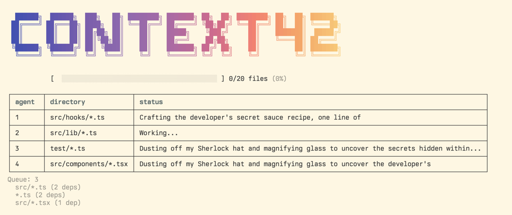
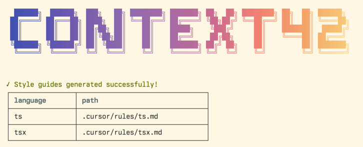
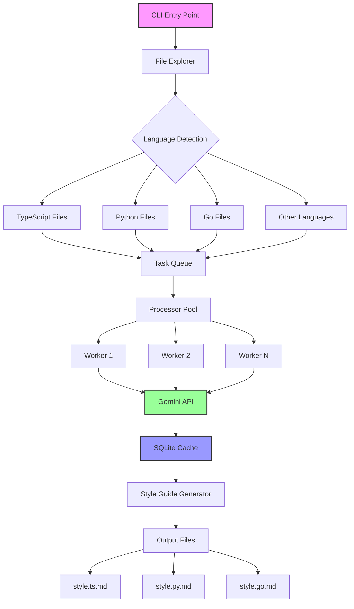

# context42

**The best code style guide is the one your team already follows.** This tool discovers it.

Let a little AI magic loose in your repo: context42 explores your codebase, chats with Google Gemini, and conjures up custom style guides for every language it finds.

## How it works

1. Recursively discovers code files in your project, respects your .gitignore
2. Groups files by language extension
3. Runs Gemini CLI concurrently to analyze code patterns
4. Recursively generates style guides (`py.md`, `ts.md`, `go.md`, etc.) based on your actual code
5. Writes style guides to your project

## Quick Start

```bash
$ export GEMINI_API_KEY="..."
$ npx context42 # or bunx, pnpx, yarn dlx, requires Node ≥22.0
```

**Output:** context42's style guides for this repo's [.ts](./cursor/rules/ts.md) and [.tsx](./cursor/rules/tsx.md) code.





## Usage

```bash
# Analyze current directory, saves results to ./context42/
context42

# Analyze specific directory
context42 -i src/

# Custom output location
context42 -o .cursor/rules/

# Set max concurrent Gemini processes (default: 4)
context42 --concurrency 8

# Resume from a previous run (useful for debugging)
context42 --run abc123-def456
```

## Why

Every codebase has implicit style rules. The problem is they're locked in developers' heads.

New team members guess. PRs get bikeshedded. Time gets wasted on "should we use `interface` or `type`?" when the answer is already in your code—if you look at the patterns.

Context42 makes the implicit explicit. It reads your code like a new developer would, but with perfect memory and pattern recognition.

## Architecture



## Development

Install deps with `mise install`, then `pnpm install`, then check out the [justfile](./justfile) for other commands.

Requires Node.js 22+ and a Gemini API key.

---

*"Good code has a rhythm. This tool finds it."*
